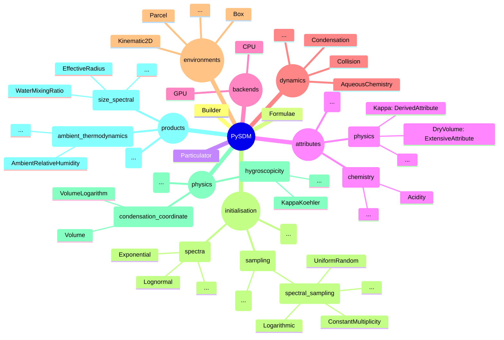
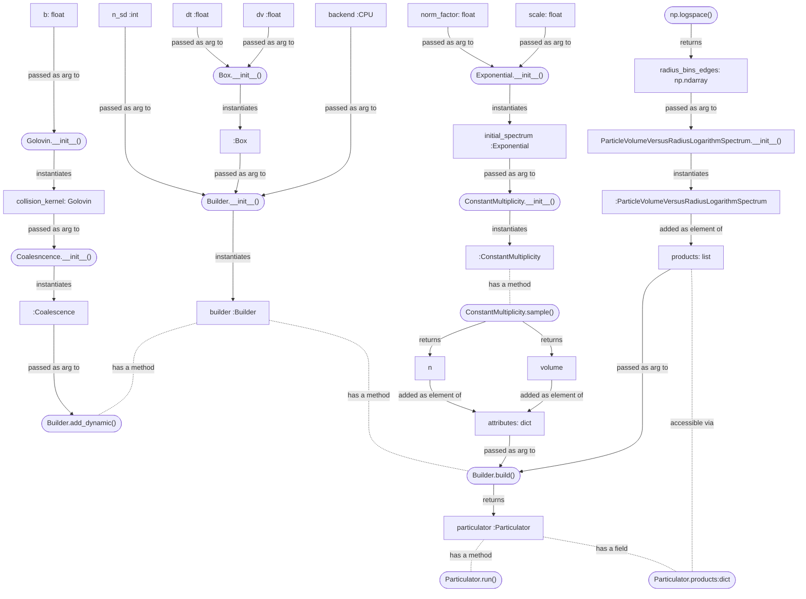

# PySDM

[](https://www.python.org/)
[](https://numba.pydata.org)
[](https://pypi.org/project/ThrustRTC/)
[](https://en.wikipedia.org/wiki/Linux)
[](https://en.wikipedia.org/wiki/macOS)
[](https://en.wikipedia.org/wiki/Windows)
[](https://jupyter.org/)
[](https://github.com/open-atmos/PySDM/graphs/commit-activity)
[](https://www.openhub.net/p/atmos-cloud-sim-uj-PySDM)
[](https://joss.theoj.org/papers/62cad07440b941f73f57d187df1aa6e9)
[](https://zenodo.org/badge/latestdoi/199064632)    
[![EU Funding](https://img.shields.io/static/v1?label=EU%20Funding%20by&color=103069&message=FNP&logoWidth=25&logo=image/png;base64,iVBORw0KGgoAAAANSUhEUgAAAC4AAAAeCAYAAABTwyyaAAAEzklEQVRYw9WYS2yUVRiGn3P5ZzozpZ3aUsrNgoKlKBINmkhpCCwwxIAhsDCpBBIWhmCMMYTEhSJ4i9EgBnSBEm81MRrFBhNXEuUSMCopiRWLQqEGLNgr085M5//POS46NNYFzHQ6qGc1i5nzP/P973m/9ztCrf7A8T9csiibCocUbvTzfxLcAcaM3cY3imXz25lT3Y34G7gQYAKV3+bFAHcATlBTPogJNADG92iY28FHW97kyPbnuW/W7xgzAhukQ9xe04PJeOT0HkQRwK0TlEeGWb/kOO9v3kdD3a8YK9GhDMfa6mg9fxunOm/lWPtcpDI4K7n/jnN8+uQbrFrUSiwU/DtSEUB/MsKKBT+zYslJqiYNgVE4JwhHkzy86wlWvrKVWDSZ/YFjZlU39yw4y/rGoyQGowWB67zl4QQue+jssMdXrQvZ/00jyeHwqCgDKwnsiJjSvkYAxsG5K9WsenYbJdqAtAjhCIxCSZt/4fK1w5A2WCvxrUAKCHwNVoA2aGmvq11jJQQapEXrgMBKqmJJugejKGWLIxXrBPFoigfv/omd675gRkU/xgqUDlAhH3UDaAAlLSqUQekAYyVTyhLs3tDMsvntlIYzOFcEcOcEGd9jx9oDbGs6QO0t/Tijxi9S4bhzxiWaVh5m94Zm0n7oui4ybo0raUlcncQnxx+g+WgDF/vLoYDmoqSl/dJUnt7XRCoTZjij0Z6Pc2LiNS4EBBkNvoeOJXN+yPWWSZeANOhwJq/98nKVwNdoL8B5AROxBKBL0gjh8DMhdCh3eJnrA0yqhLpplwmyup6IajvAOIGfKGVx3VmCRGnOMpe5QAdG0bT8CAeeep0d6z6nqjSJnQiZWEllLMWrmz6k+fE9rGk8MVqYgsGv5ZH2i1Opr+9kajzB5d74hKQ+KS3d/WVMLhtgdu1lriRiOR/4nDVunaR24x7qp3UV5Cb/fJvC83nv26W81LIK58SYNFmwq4hsGx/5BwKlzYRma2NUthgOJSew4i7ru9nJYCQF5tApb2yvjiDQKJV/IfJKh0o6qssSLKv/jcAoRKHQQzE2Lj2OMV5OkWFc4MZIpsev8uXWXRx6ZicbGk8QZLxxgwe+x/rlR3h3816+f2E7lbEU+ZDn3vKVpePCdFovzCISHqbl5EIoQOteKMPB1rto65zNyfOz+KOrGl06lHPQyi/WOohH0/T0l1MZH6A3GUEKl7Pmr2la6wBrBWWRDP2DUcqjKVKBGom9RZmABAykwnglafpSJSPQvsfiOR0EQ7ExVmazA8cY6N4K1iw6RdAXRwi4mgrheT5Dvs4LeuS81a15Ll/3dQisFVSVpnj7sf1sX/sZvhAc+6UOrQyBVUQ8gx/orFmDsZqtaw/y1qZ9zKjp5vDpenyjcNe+cLNmTiUdf/bEOddVQ0VpgsOn54ET+EYxvWKALSu+5tGG76it7MNaiZKGQ23zCIcMfUMxBnrjN3fmHHvCAlp+vJcXWx6itqoXpAEnUNLx8iMfo5Xh1i17R3PJYCpC2cZ3qK3sQ8WGEDDuXlAQuFKGHzpmopXhTNfk0bmxs7uC1w6uJul79AxFkMIiBJy5UoUWjrZLU5DCFdTARDHuDqVw+OkSwI0MCEW4gtNF2BPrBCo8fKNbtILWX9aUDqFqHnn7AAAAAElFTkSuQmCC)](https://www.fnp.org.pl/en/)
[](https://www.ncn.gov.pl/?language=en)
[](https://asr.science.energy.gov/)

[](https://www.gnu.org/licenses/gpl-3.0.html)

[](https://github.com/open-atmos/PySDM/actions)
[](https://ci.appveyor.com/project/slayoo/pysdm/branch/main)
[](https://app.codecov.io/gh/open-atmos/PySDM)    
[](https://pypi.org/project/PySDM)
[](https://open-atmos.github.io/PySDM/)

PySDM is a package for simulating the dynamics of population of particles. 
It is intended to serve as a building block for simulation systems modelling
  fluid flows involving a dispersed phase,
  with PySDM being responsible for representation of the dispersed phase.
Currently, the development is focused on atmospheric cloud physics
  applications, in particular on modelling the dynamics of particles immersed in moist air 
  using the particle-based (a.k.a. super-droplet) approach 
  to represent aerosol/cloud/rain microphysics.
The package features a Pythonic high-performance implementation of the 
  Super-Droplet Method (SDM) Monte-Carlo algorithm for representing collisional growth 
  ([Shima et al. 2009](https://rmets.onlinelibrary.wiley.com/doi/abs/10.1002/qj.441)), hence the name. 

There is a growing set of example Jupyter notebooks exemplifying how to perform 
  various types of calculations and simulations using PySDM.
Most of the example notebooks reproduce results and plot from literature, see below for 
  a list of examples and links to the notebooks (which can be either executed or viewed 
  "in the cloud").

There are also a growing set of [tutorials](https://github.com/open-atmos/PySDM/tree/main/tutorials), also in the form of Jupyter notebooks.
These tutorials are intended for teaching purposes and include short explanations of cloud microphysical 
  concepts paired with widgets for running interactive simulations using PySDM.
Each tutorial also comes with a set of questions at the end that can be used as homework problems.
Like the examples, these tutorials can be executed or viewed "in the cloud" making it an especially 
  easy way for students to get started.

PySDM has two alternative parallel number-crunching backends 
  available: multi-threaded CPU backend based on [Numba](http://numba.pydata.org/) 
  and GPU-resident backend built on top of [ThrustRTC](https://pypi.org/project/ThrustRTC/).
The [`Numba`](https://open-atmos.github.io/PySDM/PySDM/backends/numba/numba.html) backend (aliased ``CPU``) features multi-threaded parallelism for 
  multi-core CPUs, it uses the just-in-time compilation technique based on the LLVM infrastructure.
The [`ThrustRTC`](https://open-atmos.github.io/PySDM/PySDM/backends/thrustRTC/thrustRTC.html) backend (aliased ``GPU``) offers GPU-resident operation of PySDM
  leveraging the [SIMT](https://en.wikipedia.org/wiki/Single_instruction,_multiple_threads) 
  parallelisation model. 
Using the ``GPU`` backend requires nVidia hardware and [CUDA driver](https://developer.nvidia.com/cuda-downloads).

For an overview of PySDM features (and the preferred way to cite PySDM in papers), please refer to our JOSS papers:
- [Bartman et al. 2022](https://doi.org/10.21105/joss.03219) (PySDM v1).
- [de Jong, Singer et al. 2023](https://doi.org/10.21105/joss.04968) (PySDM v2).
  
PySDM includes an extension of the SDM scheme to represent collisional breakup described in [de Jong, Mackay et al. 2023](10.5194/gmd-16-4193-2023).   
For a list of talks and other materials on PySDM as well as a list of published papers featuring PySDM simulations, see the [project wiki](https://github.com/open-atmos/PySDM/wiki).

A [pdoc-generated](https://pdoc3.github.io/pdoc) documentation of PySDM public API is maintained at: [https://open-atmos.github.io/PySDM](https://open-atmos.github.io/PySDM) 

## Example Jupyter notebooks (reproducing results from literature):

See [PySDM-examples README](https://github.com/open-atmos/PySDM/blob/main/examples/README.md).


## Dependencies and Installation

PySDM dependencies are: [Numpy](https://numpy.org/), [Numba](http://numba.pydata.org/), [SciPy](https://scipy.org/), 
[Pint](https://pint.readthedocs.io/), [chempy](https://pypi.org/project/chempy/), 
[pyevtk](https://pypi.org/project/pyevtk/),
[ThrustRTC](https://fynv.github.io/ThrustRTC/) and [CURandRTC](https://github.com/fynv/CURandRTC).

To install PySDM using ``pip``, use: ``pip install PySDM`` 
(or ``pip install git+https://github.com/open-atmos/PySDM.git`` to get updates
beyond the latest release).

Conda users may use ``pip`` as well, see the [Installing non-conda packages](https://docs.conda.io/projects/conda/en/latest/user-guide/tasks/manage-pkgs.html#installing-non-conda-packages) section in the conda docs. Dependencies of PySDM are available at the following conda channels:
- numba: [numba](https://anaconda.org/numba/numba)
- conda-forge: [pyevtk](https://anaconda.org/conda-forge/pyevtk), [pint](https://anaconda.org/conda-forge/pint) and []()
- fyplus: [ThrustRTC](https://anaconda.org/fyplus/thrustrtc), [CURandRTC](https://anaconda.org/fyplus/curandrtc)
- bjodah: [chempy](https://anaconda.org/bjodah/chempy)
- nvidia: [cudatoolkit](https://anaconda.org/nvidia/cudatoolkit)

For development purposes, we suggest cloning the repository and installing it using ``pip -e``.
Test-time dependencies can be installed with ``pip -e .[tests]``.

PySDM examples constitute the [``PySDM-examples``](https://github.com/open-atmos/PySDM-examples) package.
The examples have additional dependencies listed in [``PySDM_examples`` package ``setup.py``](https://github.com/open-atmos/PySDM/blob/main/examples/setup.py) file.
Running the example Jupyter notebooks requires the ``PySDM_examples`` package to be installed.
The suggested install and launch steps are:
```
git clone https://github.com/open-atmos/PySDM.git
pip install -e PySDM
pip install -e PySDM/examples
jupyter-notebook PySDM/examples/PySDM_examples
```
Alternatively, one can also install the examples package from pypi.org by 
using ``pip install PySDM-examples`` (note that this does not apply to notebooks itself,
only the supporting .py files).

## Submodule organization


## Hello-world coalescence example in Python, Julia and Matlab

In order to depict the PySDM API with a practical example, the following
  listings provide sample code roughly reproducing the 
  Figure 2 from [Shima et al. 2009 paper](http://doi.org/10.1002/qj.441)
  using PySDM from Python, Julia and Matlab.
It is a [`Coalescence`](https://open-atmos.github.io/PySDM/PySDM/dynamics/coalescence.html)-only set-up in which the initial particle size 
  spectrum is [`Exponential`](https://open-atmos.github.io/PySDM/PySDM/initialisation/spectra.html#PySDM.initialisation.spectra.Exponential) and is deterministically sampled to match
  the condition of each super-droplet having equal initial multiplicity:
<details>
<summary>Julia (click to expand)</summary>

```Julia
using Pkg
Pkg.add("PyCall")
Pkg.add("Plots")
Pkg.add("PlotlyJS")

using PyCall
si = pyimport("PySDM.physics").si
ConstantMultiplicity = pyimport("PySDM.initialisation.sampling.spectral_sampling").ConstantMultiplicity
Exponential = pyimport("PySDM.initialisation.spectra").Exponential

n_sd = 2^15
initial_spectrum = Exponential(norm_factor=8.39e12, scale=1.19e5 * si.um^3)
attributes = Dict()
attributes["volume"], attributes["multiplicity"] = ConstantMultiplicity(spectrum=initial_spectrum).sample(n_sd)
```
</details>
<details>
<summary>Matlab (click to expand)</summary>

```Matlab
si = py.importlib.import_module('PySDM.physics').si;
ConstantMultiplicity = py.importlib.import_module('PySDM.initialisation.sampling.spectral_sampling').ConstantMultiplicity;
Exponential = py.importlib.import_module('PySDM.initialisation.spectra').Exponential;

n_sd = 2^15;
initial_spectrum = Exponential(pyargs(...
    'norm_factor', 8.39e12, ...
    'scale', 1.19e5 * si.um ^ 3 ...
));
tmp = ConstantMultiplicity(initial_spectrum).sample(int32(n_sd));
attributes = py.dict(pyargs('volume', tmp{1}, 'multiplicity', tmp{2}));
```
</details>
<details open>
<summary>Python (click to expand)</summary>

```Python
from PySDM.physics import si
from PySDM.initialisation.sampling.spectral_sampling import ConstantMultiplicity
from PySDM.initialisation.spectra.exponential import Exponential

n_sd = 2 ** 15
initial_spectrum = Exponential(norm_factor=8.39e12, scale=1.19e5 * si.um ** 3)
attributes = {}
attributes['volume'], attributes['multiplicity'] = ConstantMultiplicity(initial_spectrum).sample(n_sd)
```
</details>

The key element of the PySDM interface is the [``Particulator``](https://open-atmos.github.io/PySDM/PySDM/particulator.html) 
  class instances of which are used to manage the system state and control the simulation.
Instantiation of the [``Particulator``](https://open-atmos.github.io/PySDM/PySDM/particulator.html) class is handled by the [``Builder``](https://open-atmos.github.io/PySDM/PySDM/builder.html)
  as exemplified below:
<details>
<summary>Julia (click to expand)</summary>

```Julia
Builder = pyimport("PySDM").Builder
Box = pyimport("PySDM.environments").Box
Coalescence = pyimport("PySDM.dynamics").Coalescence
Golovin = pyimport("PySDM.dynamics.collisions.collision_kernels").Golovin
CPU = pyimport("PySDM.backends").CPU
ParticleVolumeVersusRadiusLogarithmSpectrum = pyimport("PySDM.products").ParticleVolumeVersusRadiusLogarithmSpectrum

radius_bins_edges = 10 .^ range(log10(10*si.um), log10(5e3*si.um), length=32) 

env = Box(dt=1 * si.s, dv=1e6 * si.m^3)
builder = Builder(n_sd=n_sd, backend=CPU(), environment=env)
builder.add_dynamic(Coalescence(collision_kernel=Golovin(b=1.5e3 / si.s)))
products = [ParticleVolumeVersusRadiusLogarithmSpectrum(radius_bins_edges=radius_bins_edges, name="dv/dlnr")] 
particulator = builder.build(attributes, products)
```
</details>
<details>
<summary>Matlab (click to expand)</summary>

```Matlab
Builder = py.importlib.import_module('PySDM').Builder;
Box = py.importlib.import_module('PySDM.environments').Box;
Coalescence = py.importlib.import_module('PySDM.dynamics').Coalescence;
Golovin = py.importlib.import_module('PySDM.dynamics.collisions.collision_kernels').Golovin;
CPU = py.importlib.import_module('PySDM.backends').CPU;
ParticleVolumeVersusRadiusLogarithmSpectrum = py.importlib.import_module('PySDM.products').ParticleVolumeVersusRadiusLogarithmSpectrum;

radius_bins_edges = logspace(log10(10 * si.um), log10(5e3 * si.um), 32);

env = Box(pyargs('dt', 1 * si.s, 'dv', 1e6 * si.m ^ 3));
builder = Builder(pyargs('n_sd', int32(n_sd), 'backend', CPU(), 'environment', env));
builder.add_dynamic(Coalescence(pyargs('collision_kernel', Golovin(1.5e3 / si.s))));
products = py.list({ ParticleVolumeVersusRadiusLogarithmSpectrum(pyargs( ...
  'radius_bins_edges', py.numpy.array(radius_bins_edges), ...
  'name', 'dv/dlnr' ...
)) });
particulator = builder.build(attributes, products);
```
</details>
<details open>
<summary>Python (click to expand)</summary>

```Python
import numpy as np
from PySDM import Builder
from PySDM.environments import Box
from PySDM.dynamics import Coalescence
from PySDM.dynamics.collisions.collision_kernels import Golovin
from PySDM.backends import CPU
from PySDM.products import ParticleVolumeVersusRadiusLogarithmSpectrum

radius_bins_edges = np.logspace(np.log10(10 * si.um), np.log10(5e3 * si.um), num=32)

env = Box(dt=1 * si.s, dv=1e6 * si.m ** 3)
builder = Builder(n_sd=n_sd, backend=CPU(), environment=env)
builder.add_dynamic(Coalescence(collision_kernel=Golovin(b=1.5e3 / si.s)))
products = [ParticleVolumeVersusRadiusLogarithmSpectrum(radius_bins_edges=radius_bins_edges, name='dv/dlnr')]
particulator = builder.build(attributes, products)
```
</details>

The ``backend`` argument may be set to ``CPU`` or ``GPU``
  what translates to choosing the multi-threaded backend or the 
  GPU-resident computation mode, respectively.
The employed [`Box`](https://open-atmos.github.io/PySDM/PySDM/environments/box.html) environment corresponds to a zero-dimensional framework
  (particle positions are not considered).
The vectors of particle multiplicities ``n`` and particle volumes ``v`` are
  used to initialise super-droplet attributes.
The [`Coalescence`](https://open-atmos.github.io/PySDM/PySDM/dynamics/coalescence.html)
  Monte-Carlo algorithm (Super Droplet Method) is registered as the only
  dynamic in the system.
Finally, the [`build()`](https://open-atmos.github.io/PySDM/PySDM/builder.html#PySDM.builder.Builder.build) method is used to obtain an instance
  of [`Particulator`](https://open-atmos.github.io/PySDM/PySDM/particulator.html#PySDM.particulator.Particulator) which can then be used to control time-stepping and
  access simulation state.

The [`run(nt)`](https://open-atmos.github.io/PySDM/PySDM/particulator.html#PySDM.particuparticulatorr.Particulator.run) method advances the simulation by ``nt`` timesteps.
In the listing below, its usage is interleaved with plotting logic
  which displays a histogram of particle mass distribution 
  at selected timesteps:
<details>
<summary>Julia (click to expand)</summary>

```Julia
using Plots; plotlyjs()

for step = 0:1200:3600
    particulator.run(step - particulator.n_steps)
    plot!(
        radius_bins_edges[1:end-1] / si.um,
        particulator.formulae.particle_shape_and_density.volume_to_mass(
            particulator.products["dv/dlnr"].get()[:]
        )/ si.g,
        linetype=:steppost,
        xaxis=:log,
        xlabel="particle radius [µm]",
        ylabel="dm/dlnr [g/m^3/(unit dr/r)]",
        label="t = $step s"
    )   
end
savefig("plot.svg")
```
</details>
<details>
<summary>Matlab (click to expand)</summary>

```Matlab
for step = 0:1200:3600
    particulator.run(int32(step - particulator.n_steps));
    x = radius_bins_edges / si.um;
    y = particulator.formulae.particle_shape_and_density.volume_to_mass( ...
        particulator.products{"dv/dlnr"}.get() ...
    ) / si.g;
    stairs(...
        x(1:end-1), ... 
        double(py.array.array('d',py.numpy.nditer(y))), ...
        'DisplayName', sprintf("t = %d s", step) ...
    );
    hold on
end
hold off
set(gca,'XScale','log');
xlabel('particle radius [µm]')
ylabel("dm/dlnr [g/m^3/(unit dr/r)]")
legend()
```
</details>
<details open>
<summary>Python (click to expand)</summary>

```Python
from matplotlib import pyplot

for step in [0, 1200, 2400, 3600]:
    particulator.run(step - particulator.n_steps)
    pyplot.step(
        x=radius_bins_edges[:-1] / si.um,
        y=particulator.formulae.particle_shape_and_density.volume_to_mass(
            particulator.products['dv/dlnr'].get()[0]
        ) / si.g,
        where='post', label=f"t = {step}s"
    )

pyplot.xscale('log')
pyplot.xlabel('particle radius [µm]')
pyplot.ylabel("dm/dlnr [g/m$^3$/(unit dr/r)]")
pyplot.legend()
pyplot.savefig('readme.png')
```
</details>

The resultant plot (generated with the Python code) looks as follows:


The component submodules used to create this simulation are visualized below:


## Hello-world condensation example in Python, Julia and Matlab

In the following example, a condensation-only setup is used with the adiabatic 
[`Parcel`](https://open-atmos.github.io/PySDM/PySDM/environments/parcel.html) environment.
An initial [`Lognormal`](https://open-atmos.github.io/PySDM/PySDM/initialisation/spectra.html#PySDM.initialisation.spectra.Lognormal)
spectrum of dry aerosol particles is first initialised to equilibrium wet size for the given
initial humidity. 
Subsequent particle growth due to [`Condensation`](https://open-atmos.github.io/PySDM/PySDM/dynamics/condensation.html) of water vapour (coupled with the release of latent heat)
causes a subset of particles to activate into cloud droplets.
Results of the simulation are plotted against vertical 
[`ParcelDisplacement`](https://open-atmos.github.io/PySDM/PySDM/products/housekeeping/parcel_displacement.html)
and depict the evolution of 
[`PeakSupersaturation`](https://open-atmos.github.io/PySDM/PySDM/products/condensation/peak_supersaturation.html), 
[`EffectiveRadius`](https://open-atmos.github.io/PySDM/PySDM/products/size_spectral/effective_radius.html), 
[`ParticleConcentration`](https://open-atmos.github.io/PySDM/PySDM/products/size_spectral/particle_concentration.html#PySDM.products.particles_concentration.ParticleConcentration) 
and the 
[`WaterMixingRatio `](https://open-atmos.github.io/PySDM/PySDM/products/size_spectral/water_mixing_ratio.html).

<details>
<summary>Julia (click to expand)</summary>

```Julia
using PyCall
using Plots; plotlyjs()
si = pyimport("PySDM.physics").si
spectral_sampling = pyimport("PySDM.initialisation.sampling").spectral_sampling
discretise_multiplicities = pyimport("PySDM.initialisation").discretise_multiplicities
Lognormal = pyimport("PySDM.initialisation.spectra").Lognormal
equilibrate_wet_radii = pyimport("PySDM.initialisation").equilibrate_wet_radii
CPU = pyimport("PySDM.backends").CPU
AmbientThermodynamics = pyimport("PySDM.dynamics").AmbientThermodynamics
Condensation = pyimport("PySDM.dynamics").Condensation
Parcel = pyimport("PySDM.environments").Parcel
Builder = pyimport("PySDM").Builder
Formulae = pyimport("PySDM").Formulae
products = pyimport("PySDM.products")

env = Parcel(
    dt=.25 * si.s,
    mass_of_dry_air=1e3 * si.kg,
    p0=1122 * si.hPa,
    initial_water_vapour_mixing_ratio=20 * si.g / si.kg,
    T0=300 * si.K,
    w= 2.5 * si.m / si.s
)
spectrum = Lognormal(norm_factor=1e4/si.mg, m_mode=50*si.nm, s_geom=1.4)
kappa = .5 * si.dimensionless
cloud_range = (.5 * si.um, 25 * si.um)
output_interval = 4
output_points = 40
n_sd = 256

formulae = Formulae()
builder = Builder(backend=CPU(formulae), n_sd=n_sd, environment=env)
builder.add_dynamic(AmbientThermodynamics())
builder.add_dynamic(Condensation())

r_dry, specific_concentration = spectral_sampling.Logarithmic(spectrum).sample(n_sd)
v_dry = formulae.trivia.volume(radius=r_dry)
r_wet = equilibrate_wet_radii(r_dry=r_dry, environment=env, kappa_times_dry_volume=kappa * v_dry)

attributes = Dict()
attributes["multiplicity"] = discretise_multiplicities(specific_concentration * env.mass_of_dry_air)
attributes["dry volume"] = v_dry
attributes["kappa times dry volume"] = kappa * v_dry
attributes["volume"] = formulae.trivia.volume(radius=r_wet) 

particulator = builder.build(attributes, products=[
    products.PeakSupersaturation(name="S_max", unit="%"),
    products.EffectiveRadius(name="r_eff", unit="um", radius_range=cloud_range),
    products.ParticleConcentration(name="n_c_cm3", unit="cm^-3", radius_range=cloud_range),
    products.WaterMixingRatio(name="liquid water mixing ratio", unit="g/kg", radius_range=cloud_range),
    products.ParcelDisplacement(name="z")
])
    
cell_id=1
output = Dict()
for (_, product) in particulator.products
    output[product.name] = Array{Float32}(undef, output_points+1)
    output[product.name][1] = product.get()[cell_id]
end 
    
for step = 2:output_points+1
    particulator.run(steps=output_interval)
    for (_, product) in particulator.products
        output[product.name][step] = product.get()[cell_id]
    end 
end 

plots = []
ylbl = particulator.products["z"].unit
for (_, product) in particulator.products
    if product.name != "z"
        append!(plots, [plot(output[product.name], output["z"], ylabel=ylbl, xlabel=product.unit, title=product.name)])
    end
    global ylbl = ""
end
plot(plots..., layout=(1, length(output)-1))
savefig("parcel.svg")
```
</details>
<details>
<summary>Matlab (click to expand)</summary>

```Matlab
si = py.importlib.import_module('PySDM.physics').si;
spectral_sampling = py.importlib.import_module('PySDM.initialisation.sampling').spectral_sampling;
discretise_multiplicities = py.importlib.import_module('PySDM.initialisation').discretise_multiplicities;
Lognormal = py.importlib.import_module('PySDM.initialisation.spectra').Lognormal;
equilibrate_wet_radii = py.importlib.import_module('PySDM.initialisation').equilibrate_wet_radii;
CPU = py.importlib.import_module('PySDM.backends').CPU;
AmbientThermodynamics = py.importlib.import_module('PySDM.dynamics').AmbientThermodynamics;
Condensation = py.importlib.import_module('PySDM.dynamics').Condensation;
Parcel = py.importlib.import_module('PySDM.environments').Parcel;
Builder = py.importlib.import_module('PySDM').Builder;
Formulae = py.importlib.import_module('PySDM').Formulae;
products = py.importlib.import_module('PySDM.products');

env = Parcel(pyargs( ...
    'dt', .25 * si.s, ...
    'mass_of_dry_air', 1e3 * si.kg, ...
    'p0', 1122 * si.hPa, ...
    'initial_water_vapour_mixing_ratio', 20 * si.g / si.kg, ...
    'T0', 300 * si.K, ...
    'w', 2.5 * si.m / si.s ...
));
spectrum = Lognormal(pyargs('norm_factor', 1e4/si.mg, 'm_mode', 50 * si.nm, 's_geom', 1.4));
kappa = .5;
cloud_range = py.tuple({.5 * si.um, 25 * si.um});
output_interval = 4;
output_points = 40;
n_sd = 256;

formulae = Formulae();
builder = Builder(pyargs('backend', CPU(formulae), 'n_sd', int32(n_sd), 'environment', env));
builder.add_dynamic(AmbientThermodynamics());
builder.add_dynamic(Condensation());

tmp = spectral_sampling.Logarithmic(spectrum).sample(int32(n_sd));
r_dry = tmp{1};
v_dry = formulae.trivia.volume(pyargs('radius', r_dry));
specific_concentration = tmp{2};
r_wet = equilibrate_wet_radii(pyargs(...
    'r_dry', r_dry, ...
    'environment', env, ...
    'kappa_times_dry_volume', kappa * v_dry...
));

attributes = py.dict(pyargs( ...
    'multiplicity', discretise_multiplicities(specific_concentration * env.mass_of_dry_air), ...
    'dry volume', v_dry, ...
    'kappa times dry volume', kappa * v_dry, ... 
    'volume', formulae.trivia.volume(pyargs('radius', r_wet)) ...
));

particulator = builder.build(attributes, py.list({ ...
    products.PeakSupersaturation(pyargs('name', 'S_max', 'unit', '%')), ...
    products.EffectiveRadius(pyargs('name', 'r_eff', 'unit', 'um', 'radius_range', cloud_range)), ...
    products.ParticleConcentration(pyargs('name', 'n_c_cm3', 'unit', 'cm^-3', 'radius_range', cloud_range)), ...
    products.WaterMixingRatio(pyargs('name', 'liquid water mixing ratio', 'unit', 'g/kg', 'radius_range', cloud_range)) ...
    products.ParcelDisplacement(pyargs('name', 'z')) ...
}));

cell_id = int32(0);
output_size = [output_points+1, length(py.list(particulator.products.keys()))];
output_types = repelem({'double'}, output_size(2));
output_names = [cellfun(@string, cell(py.list(particulator.products.keys())))];
output = table(...
    'Size', output_size, ...
    'VariableTypes', output_types, ...
    'VariableNames', output_names ...
);
for pykey = py.list(keys(particulator.products))
    get = py.getattr(particulator.products{pykey{1}}.get(), '__getitem__');
    key = string(pykey{1});
    output{1, key} = get(cell_id);
end

for i=2:output_points+1
    particulator.run(pyargs('steps', int32(output_interval)));
    for pykey = py.list(keys(particulator.products))
        get = py.getattr(particulator.products{pykey{1}}.get(), '__getitem__');
        key = string(pykey{1});
        output{i, key} = get(cell_id);
    end
end

i=1;
for pykey = py.list(keys(particulator.products))
    product = particulator.products{pykey{1}};
    if string(product.name) ~= "z"
        subplot(1, width(output)-1, i);
        plot(output{:, string(pykey{1})}, output.z, '-o');
        title(string(product.name), 'Interpreter', 'none');
        xlabel(string(product.unit));
    end
    if i == 1
        ylabel(string(particulator.products{"z"}.unit));
    end
    i=i+1;
end
saveas(gcf, "parcel.png");
```
</details>
<details open>
<summary>Python (click to expand)</summary>

```Python
from matplotlib import pyplot
from PySDM.physics import si
from PySDM.initialisation import discretise_multiplicities, equilibrate_wet_radii
from PySDM.initialisation.spectra import Lognormal
from PySDM.initialisation.sampling import spectral_sampling
from PySDM.backends import CPU
from PySDM.dynamics import AmbientThermodynamics, Condensation
from PySDM.environments import Parcel
from PySDM import Builder, Formulae, products

env = Parcel(
  dt=.25 * si.s,
  mass_of_dry_air=1e3 * si.kg,
  p0=1122 * si.hPa,
  initial_water_vapour_mixing_ratio=20 * si.g / si.kg,
  T0=300 * si.K,
  w=2.5 * si.m / si.s
)
spectrum = Lognormal(norm_factor=1e4 / si.mg, m_mode=50 * si.nm, s_geom=1.5)
kappa = .5 * si.dimensionless
cloud_range = (.5 * si.um, 25 * si.um)
output_interval = 4
output_points = 40
n_sd = 256

formulae = Formulae()
builder = Builder(backend=CPU(formulae), n_sd=n_sd, environment=env)
builder.add_dynamic(AmbientThermodynamics())
builder.add_dynamic(Condensation())

r_dry, specific_concentration = spectral_sampling.Logarithmic(spectrum).sample(n_sd)
v_dry = formulae.trivia.volume(radius=r_dry)
r_wet = equilibrate_wet_radii(r_dry=r_dry, environment=env, kappa_times_dry_volume=kappa * v_dry)

attributes = {
  'multiplicity': discretise_multiplicities(specific_concentration * env.mass_of_dry_air),
  'dry volume': v_dry,
  'kappa times dry volume': kappa * v_dry,
  'volume': formulae.trivia.volume(radius=r_wet)
}

particulator = builder.build(attributes, products=[
  products.PeakSupersaturation(name='S_max', unit='%'),
  products.EffectiveRadius(name='r_eff', unit='um', radius_range=cloud_range),
  products.ParticleConcentration(name='n_c_cm3', unit='cm^-3', radius_range=cloud_range),
  products.WaterMixingRatio(name='liquid water mixing ratio', unit='g/kg', radius_range=cloud_range),
  products.ParcelDisplacement(name='z')
])

cell_id = 0
output = {product.name: [product.get()[cell_id]] for product in particulator.products.values()}

for step in range(output_points):
  particulator.run(steps=output_interval)
  for product in particulator.products.values():
    output[product.name].append(product.get()[cell_id])

fig, axs = pyplot.subplots(1, len(particulator.products) - 1, sharey="all")
for i, (key, product) in enumerate(particulator.products.items()):
  if key != 'z':
    axs[i].plot(output[key], output['z'], marker='.')
    axs[i].set_title(product.name)
    axs[i].set_xlabel(product.unit)
    axs[i].grid()
axs[0].set_ylabel(particulator.products['z'].unit)
pyplot.savefig('parcel.svg')
```
</details>

The resultant plot (generated with the Matlab code) looks as follows:


## Contributing, reporting issues, seeking support 

#### Our technologicial stack:   
[](https://www.python.org/)
[](https://numba.pydata.org)
[](https://llvm.org)
[](https://pypi.org/project/ThrustRTC/)
[](https://numpy.org/)
[](https://pytest.org/)   
[](https://colab.research.google.com/)
[](https://codecov.io/)
[](https://pypi.org/)
[](https://github.com/features/actions)
[](https://jupyter.org/)
[](https:///)

Submitting new code to the project, please preferably use [GitHub pull requests](https://github.com/open-atmos/PySDM/pulls) - it helps to keep record of code authorship, 
track and archive the code review workflow and allows to benefit
from the continuous integration setup which automates execution of tests 
with the newly added code. 

Code contributions are assumed to imply transfer of copyright.
Should there be a need to make an exception, please indicate it when creating
a pull request or contributing code in any other way. In any case, 
the license of the contributed code must be compatible with GPL v3.

Developing the code, we follow [The Way of Python](https://www.python.org/dev/peps/pep-0020/) and 
the [KISS principle](https://en.wikipedia.org/wiki/KISS_principle).
The codebase has greatly benefited from [PyCharm code inspections](https://www.jetbrains.com/help/pycharm/code-inspection.html)
and [Pylint](https://pylint.org), [Black](https://black.readthedocs.io/en/stable/) and [isort](https://pycqa.github.io/isort/)
code analysis (which are all part of the CI workflows).

We also use [pre-commit hooks](https://pre-commit.com). 
In our case, the hooks modify files and re-format them.
The pre-commit hooks can be run locally, and then the resultant changes need to be staged before committing.
To set up the hooks locally, install pre-commit via `pip install pre-commit` and
set up the git hooks via `pre-commit install` (this needs to be done every time you clone the project).
To run all pre-commit hooks, run `pre-commit run --all-files`.
The `.pre-commit-config.yaml` file can be modified in case new hooks are to be added or
  existing ones need to be altered.  

Further hints addressed at PySDM developers are maintained in the [open-atmos/python-dev-hints Wiki](https://github.com/open-atmos/python-dev-hints/wiki).

Issues regarding any incorrect, unintuitive or undocumented bahaviour of
PySDM are best to be reported on the [GitHub issue tracker](https://github.com/open-atmos/PySDM/issues/new).
Feature requests are recorded in the "Ideas..." [PySDM wiki page](https://github.com/open-atmos/PySDM/wiki/Ideas-for-new-features-and-examples).

We encourage to use the [GitHub Discussions](https://github.com/open-atmos/PySDM/discussions) feature
(rather than the issue tracker) for seeking support in understanding, using and extending PySDM code.

We look forward to your contributions and feedback.

## Credits:

The development and maintenance of PySDM is led by [Sylwester Arabas](https://github.com/slayoo/).
[Piotr Bartman](https://github.com/piotrbartman/) had been the architect and main developer 
of technological solutions in PySDM. 
PySDM includes contributions from researchers 
from [Jagiellonian University](https://en.uj.edu.pl/en) departments of computer science, physics and chemistry;
from [Caltech's Climate Modelling Alliance](https://clima.caltech.edu/),
from [University of Warsaw](https://en.uw.edu.pl/) (dept. physics), and
from [AGH University of Krakow](https://agh.edu.pl/en) (dept. physics \& applied computer science) where release maintenance takes place currently.

Development of PySDM had been initially supported by the EU through a grant of the 
[Foundation for Polish Science](https://www.fnp.org.pl/)) (grant no. POIR.04.04.00-00-5E1C/18) 
realised at the [Jagiellonian University](https://en.uj.edu.pl/en).
The immersion freezing support in PySDM was developed with support from the
US Department of Energy [Atmospheric System Research](https://asr.science.energy.gov/) programme
through a grant (no. DE-SC0021034) realised at the 
[University of Illinois at Urbana-Champaign](https://illinois.edu/).
Development of isotopic fractionation representation and mixed-phase support is carried out with support from
the [Polish National Science Centre](https://ncn.gov.pl/en) (grant no. 2020/39/D/ST10/01220).

copyright: [Jagiellonian University](https://en.uj.edu.pl/en) (2019-2023) & [AGH University of Krakow](https://agh.edu.pl/en) (2023-...)    
licence: [GPL v3](https://www.gnu.org/licenses/gpl-3.0.html)

## Related resources and open-source projects

### SDM patents (some expired, some withdrawn):
- https://patents.google.com/patent/US7756693B2
- https://patents.google.com/patent/EP1847939A3
- https://patents.google.com/patent/JP4742387B2
- https://patents.google.com/patent/CN101059821B

### Other SDM implementations:
- SCALE-SDM (Fortran):    
  https://github.com/Shima-Lab/SCALE-SDM_BOMEX_Sato2018/blob/master/contrib/SDM/sdm_coalescence.f90
- Pencil Code (Fortran):    
  https://github.com/pencil-code/pencil-code/blob/master/src/particles_coagulation.f90
- PALM LES (Fortran):    
  https://palm.muk.uni-hannover.de/trac/browser/palm/trunk/SOURCE/lagrangian_particle_model_mod.f90
- libcloudph++ (C++):    
  https://github.com/igfuw/libcloudphxx/blob/master/src/impl/particles_impl_coal.ipp
- LCM1D (Python)    
  https://github.com/SimonUnterstrasser/ColumnModel
- superdroplet (Cython/Numba/C++11/Fortran 2008/Julia)   
  https://github.com/darothen/superdroplet
- NTLP (FORTRAN)   
  https://github.com/Folca/NTLP/blob/SuperDroplet/les.F
- CLEO (C++)    
  https://yoctoyotta1024.github.io/CLEO/
- droplets.jl (Julia)   
  https://github.com/emmacware/droplets.jl
- LacmoPy (Python/Numba)    
  https://github.com/JanKBohrer/LacmoPy/blob/master/collision/all_or_nothing.py

### non-SDM probabilistic particle-based coagulation solvers

- PartMC (Fortran):    
  https://github.com/compdyn/partmc

### Python models with discrete-particle (moving-sectional) representation of particle size spectrum

- pyrcel: https://github.com/darothen/pyrcel
- PyBox: https://github.com/loftytopping/PyBox
- py-cloud-parcel-model: https://github.com/emmasimp/py-cloud-parcel-model

### non-Python cloud microphysics open-source software

- CloudMicrophysics.jl: https://github.com/CliMA/CloudMicrophysics.jl
