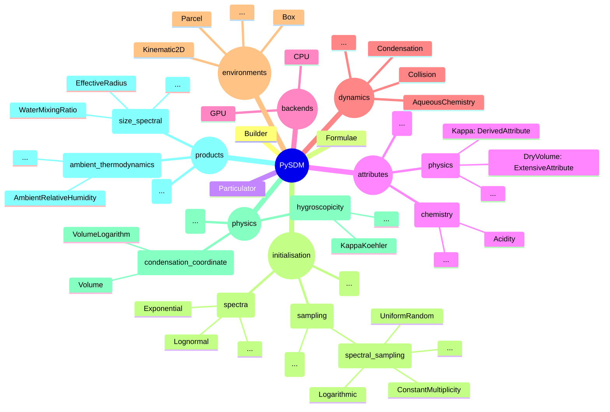

```mermaid
mindmap
  root((PySDM))
    Builder
    Formulae
    Particulator
    ((attributes))
      (physics)
        DryVolume: ExtensiveAttribute
        Kappa: DerivedAttribute
        ...
      (chemistry)
        Acidity
        ...
      (...)
    ((backends))
      CPU
      GPU
    ((dynamics))
      AqueousChemistry
      Collision
      Condensation
      ...
    ((environments))
      Box
      Parcel
      Kinematic2D
      ...
    ((initialisation))
      (spectra)
        Lognormal
        Exponential
        ...
      (sampling)
        (spectral_sampling)
          ConstantMultiplicity
          UniformRandom
          Logarithmic
          ...
        (...)  
      (...)
    ((physics))
      (hygroscopicity)
        KappaKoehler
        ...
      (condensation_coordinate)
        Volume
        VolumeLogarithm
      (...)
    ((products))
      (size_spectral)
        EffectiveRadius
        WaterMixingRatio
        ...
      (ambient_thermodynamics)
        AmbientRelativeHumidity
        ...
      (...)
```