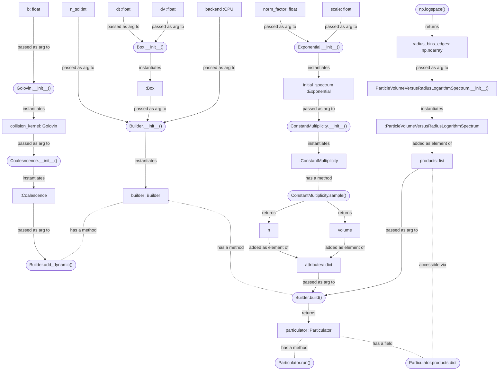
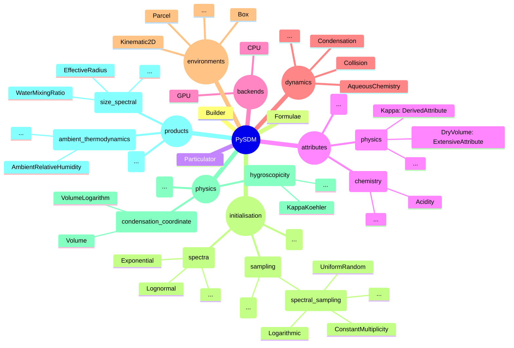

# Introduction


PySDM offers a set of building blocks for development of atmospheric cloud
simulation systems revolving around the particle-based microphysics modelling concept
and the Super-Droplet Method algorithm ([Shima et al. 2009](https://doi.org/10.1002/qj.441))
for numerically tackling the probabilistic representation of particle coagulation.

For details on PySDM dependencies and installation procedures, see
[project docs homepage](https://open-atmos.github.io/PySDM).

Below, a set of basic usage examples in **Python**, **Julia** and **Matlab** is provided
as a tutorial
More elaborate examples reproducing results from literature, engineered in Python and accompanied by Jupyter
notebooks are maintained in the
[PySDM-examples package](https://open-atmos.github.io/PySDM/PySDM_examples).

# Tutorials

## Hello-world coalescence example in Python, Julia and Matlab

In order to depict the PySDM API with a practical example, the following
  listings provide sample code roughly reproducing the
  Figure 2 from [Shima et al. 2009 paper](http://doi.org/10.1002/qj.441)
  using PySDM from Python, Julia and Matlab.
It is a [`Coalescence`](https://open-atmos.github.io/PySDM/PySDM/dynamics/collisions/collision.html#Coalescence)-only set-up in which the initial particle size
  spectrum is [`Exponential`](https://open-atmos.github.io/PySDM/PySDM/initialisation/spectra/exponential.html#Exponential) and is deterministically sampled to match
  the condition of each super-droplet having equal initial multiplicity:
<details>
<summary>Julia (click to expand)</summary>

```Julia
using Pkg
Pkg.add("PyCall")
Pkg.add("Plots")
Pkg.add("PlotlyJS")

using PyCall
si = pyimport("PySDM.physics").si
ConstantMultiplicity = pyimport("PySDM.initialisation.sampling.spectral_sampling").ConstantMultiplicity
Exponential = pyimport("PySDM.initialisation.spectra").Exponential

n_sd = 2^15
initial_spectrum = Exponential(norm_factor=8.39e12, scale=1.19e5 * si.um^3)
attributes = Dict()
attributes["volume"], attributes["multiplicity"] = ConstantMultiplicity(spectrum=initial_spectrum).sample(n_sd)
```
</details>
<details>
<summary>Matlab (click to expand)</summary>

```Matlab
si = py.importlib.import_module('PySDM.physics').si;
ConstantMultiplicity = py.importlib.import_module('PySDM.initialisation.sampling.spectral_sampling').ConstantMultiplicity;
Exponential = py.importlib.import_module('PySDM.initialisation.spectra').Exponential;

n_sd = 2^15;
initial_spectrum = Exponential(pyargs(...
    'norm_factor', 8.39e12, ...
    'scale', 1.19e5 * si.um ^ 3 ...
));
tmp = ConstantMultiplicity(initial_spectrum).sample(int32(n_sd));
attributes = py.dict(pyargs('volume', tmp{1}, 'multiplicity', tmp{2}));
```
</details>
<details open>
<summary>Python (click to expand)</summary>

```Python
from PySDM.physics import si
from PySDM.initialisation.sampling.spectral_sampling import ConstantMultiplicity
from PySDM.initialisation.spectra.exponential import Exponential

n_sd = 2 ** 15
initial_spectrum = Exponential(norm_factor=8.39e12, scale=1.19e5 * si.um ** 3)
attributes = {}
attributes['volume'], attributes['multiplicity'] = ConstantMultiplicity(initial_spectrum).sample(n_sd)
```
</details>

The key element of the PySDM interface is the [``Particulator``](https://open-atmos.github.io/PySDM/PySDM/particulator.html#Particulator)
  class instances of which are used to manage the system state and control the simulation.
Instantiation of the [``Particulator``](https://open-atmos.github.io/PySDM/PySDM/particulator.html#Particulator) class is handled by the [``Builder``](https://open-atmos.github.io/PySDM/PySDM/builder.html#Builder)
  as exemplified below:
<details>
<summary>Julia (click to expand)</summary>

```Julia
Builder = pyimport("PySDM").Builder
Box = pyimport("PySDM.environments").Box
Coalescence = pyimport("PySDM.dynamics").Coalescence
Golovin = pyimport("PySDM.dynamics.collisions.collision_kernels").Golovin
CPU = pyimport("PySDM.backends").CPU
ParticleVolumeVersusRadiusLogarithmSpectrum = pyimport("PySDM.products").ParticleVolumeVersusRadiusLogarithmSpectrum

radius_bins_edges = 10 .^ range(log10(10*si.um), log10(5e3*si.um), length=32)

env = Box(dt=1 * si.s, dv=1e6 * si.m^3)
builder = Builder(n_sd=n_sd, backend=CPU(), environment=env)
builder.add_dynamic(Coalescence(collision_kernel=Golovin(b=1.5e3 / si.s)))
products = [ParticleVolumeVersusRadiusLogarithmSpectrum(radius_bins_edges=radius_bins_edges, name="dv/dlnr")]
particulator = builder.build(attributes, products)
```
</details>
<details>
<summary>Matlab (click to expand)</summary>

```Matlab
Builder = py.importlib.import_module('PySDM').Builder;
Box = py.importlib.import_module('PySDM.environments').Box;
Coalescence = py.importlib.import_module('PySDM.dynamics').Coalescence;
Golovin = py.importlib.import_module('PySDM.dynamics.collisions.collision_kernels').Golovin;
CPU = py.importlib.import_module('PySDM.backends').CPU;
ParticleVolumeVersusRadiusLogarithmSpectrum = py.importlib.import_module('PySDM.products').ParticleVolumeVersusRadiusLogarithmSpectrum;

radius_bins_edges = logspace(log10(10 * si.um), log10(5e3 * si.um), 32);

env = Box(pyargs('dt', 1 * si.s, 'dv', 1e6 * si.m ^ 3));
builder = Builder(pyargs('n_sd', int32(n_sd), 'backend', CPU(), 'environment', env));
builder.add_dynamic(Coalescence(pyargs('collision_kernel', Golovin(1.5e3 / si.s))));
products = py.list({ ParticleVolumeVersusRadiusLogarithmSpectrum(pyargs( ...
  'radius_bins_edges', py.numpy.array(radius_bins_edges), ...
  'name', 'dv/dlnr' ...
)) });
particulator = builder.build(attributes, products);
```
</details>
<details open>
<summary>Python (click to expand)</summary>

```Python
import numpy as np
from PySDM import Builder
from PySDM.environments import Box
from PySDM.dynamics import Coalescence
from PySDM.dynamics.collisions.collision_kernels import Golovin
from PySDM.backends import CPU
from PySDM.products import ParticleVolumeVersusRadiusLogarithmSpectrum

radius_bins_edges = np.logspace(np.log10(10 * si.um), np.log10(5e3 * si.um), num=32)

env = Box(dt=1 * si.s, dv=1e6 * si.m ** 3)
builder = Builder(n_sd=n_sd, backend=CPU(), environment=env)
builder.add_dynamic(Coalescence(collision_kernel=Golovin(b=1.5e3 / si.s)))
products = [ParticleVolumeVersusRadiusLogarithmSpectrum(radius_bins_edges=radius_bins_edges, name='dv/dlnr')]
particulator = builder.build(attributes, products)
```
</details>

The ``backend`` argument may be set to ``CPU`` or ``GPU``
  what translates to choosing the multi-threaded backend or the
  GPU-resident computation mode, respectively.
The employed [`Box`](https://open-atmos.github.io/PySDM/PySDM/environments/box.html#Box) environment corresponds to a zero-dimensional framework
  (particle positions are not considered).
The vectors of particle multiplicities ``n`` and particle volumes ``v`` are
  used to initialise super-droplet attributes.
The [`Coalescence`](https://open-atmos.github.io/PySDM/PySDM/dynamics/collisions/collision.html#Coalescence)
  Monte-Carlo algorithm (Super Droplet Method) is registered as the only
  dynamic in the system.
Finally, the [`build()`](https://open-atmos.github.io/PySDM/PySDM/builder.html#Builder.build) method is used to obtain an instance
  of [`Particulator`](https://open-atmos.github.io/PySDM/PySDM/particulator.html#Particulator) which can then be used to control time-stepping and
  access simulation state.

The [`run(nt)`](https://open-atmos.github.io/PySDM/PySDM/particulator.html#Particulator.run) method advances the simulation by ``nt`` timesteps.
In the listing below, its usage is interleaved with plotting logic
  which displays a histogram of particle mass distribution
  at selected timesteps:
<details>
<summary>Julia (click to expand)</summary>

```Julia
using Plots; plotlyjs()

for step = 0:1200:3600
    particulator.run(step - particulator.n_steps)
    plot!(
        radius_bins_edges[1:end-1] / si.um,
        particulator.formulae.particle_shape_and_density.volume_to_mass(
            particulator.products["dv/dlnr"].get()[:]
        )/ si.g,
        linetype=:steppost,
        xaxis=:log,
        xlabel="particle radius [µm]",
        ylabel="dm/dlnr [g/m^3/(unit dr/r)]",
        label="t = $step s"
    )
end
savefig("plot.svg")
```
</details>
<details>
<summary>Matlab (click to expand)</summary>

```Matlab
for step = 0:1200:3600
    particulator.run(int32(step - particulator.n_steps));
    x = radius_bins_edges / si.um;
    y = particulator.formulae.particle_shape_and_density.volume_to_mass( ...
        particulator.products{"dv/dlnr"}.get() ...
    ) / si.g;
    stairs(...
        x(1:end-1), ...
        double(py.array.array('d',py.numpy.nditer(y))), ...
        'DisplayName', sprintf("t = %d s", step) ...
    );
    hold on
end
hold off
set(gca,'XScale','log');
xlabel('particle radius [µm]')
ylabel("dm/dlnr [g/m^3/(unit dr/r)]")
legend()
```
</details>
<details open>
<summary>Python (click to expand)</summary>

```Python
from matplotlib import pyplot

for step in [0, 1200, 2400, 3600]:
    particulator.run(step - particulator.n_steps)
    pyplot.step(
        x=radius_bins_edges[:-1] / si.um,
        y=particulator.formulae.particle_shape_and_density.volume_to_mass(
            particulator.products['dv/dlnr'].get()[0]
        ) / si.g,
        where='post', label=f"t = {step}s"
    )

pyplot.xscale('log')
pyplot.xlabel('particle radius [µm]')
pyplot.ylabel("dm/dlnr [g/m$^3$/(unit dr/r)]")
pyplot.legend()
pyplot.savefig('readme.png')
```
</details>

The resultant plot (generated with the Python code) looks as follows:


The component submodules used to create this simulation are visualized below:

## Hello-world condensation example in Python, Julia and Matlab

In the following example, a condensation-only setup is used with the adiabatic
[`Parcel`](https://open-atmos.github.io/PySDM/PySDM/environments/parcel.html) environment.
An initial [`Lognormal`](https://open-atmos.github.io/PySDM/PySDM/initialisation/spectra/lognormal.html#Lognormal)
spectrum of dry aerosol particles is first initialised to equilibrium wet size for the given
initial humidity.
Subsequent particle growth due to [`Condensation`](https://open-atmos.github.io/PySDM/PySDM/dynamics/condensation.html) of water vapour (coupled with the release of latent heat)
causes a subset of particles to activate into cloud droplets.
Results of the simulation are plotted against vertical
[`ParcelDisplacement`](https://open-atmos.github.io/PySDM/PySDM/products/housekeeping/parcel_displacement.html)
and depict the evolution of
[`PeakSupersaturation`](https://open-atmos.github.io/PySDM/PySDM/products/condensation/peak_supersaturation.html),
[`EffectiveRadius`](https://open-atmos.github.io/PySDM/PySDM/products/size_spectral/effective_radius.html),
[`ParticleConcentration`](https://open-atmos.github.io/PySDM/PySDM/products/size_spectral/particle_concentration.html#ParticleConcentration)
and the
[`WaterMixingRatio `](https://open-atmos.github.io/PySDM/PySDM/products/size_spectral/water_mixing_ratio.html).

<details>
<summary>Julia (click to expand)</summary>

```Julia
using PyCall
using Plots; plotlyjs()
si = pyimport("PySDM.physics").si
spectral_sampling = pyimport("PySDM.initialisation.sampling").spectral_sampling
discretise_multiplicities = pyimport("PySDM.initialisation").discretise_multiplicities
Lognormal = pyimport("PySDM.initialisation.spectra").Lognormal
equilibrate_wet_radii = pyimport("PySDM.initialisation").equilibrate_wet_radii
CPU = pyimport("PySDM.backends").CPU
AmbientThermodynamics = pyimport("PySDM.dynamics").AmbientThermodynamics
Condensation = pyimport("PySDM.dynamics").Condensation
Parcel = pyimport("PySDM.environments").Parcel
Builder = pyimport("PySDM").Builder
Formulae = pyimport("PySDM").Formulae
products = pyimport("PySDM.products")

env = Parcel(
    dt=.25 * si.s,
    mass_of_dry_air=1e3 * si.kg,
    p0=1122 * si.hPa,
    initial_water_vapour_mixing_ratio=20 * si.g / si.kg,
    T0=300 * si.K,
    w= 2.5 * si.m / si.s
)
spectrum = Lognormal(norm_factor=1e4/si.mg, m_mode=50*si.nm, s_geom=1.4)
kappa = .5 * si.dimensionless
cloud_range = (.5 * si.um, 25 * si.um)
output_interval = 4
output_points = 40
n_sd = 256

formulae = Formulae()
builder = Builder(backend=CPU(formulae), n_sd=n_sd, environment=env)
builder.add_dynamic(AmbientThermodynamics())
builder.add_dynamic(Condensation())

r_dry, specific_concentration = spectral_sampling.Logarithmic(spectrum).sample(n_sd)
v_dry = formulae.trivia.volume(radius=r_dry)
r_wet = equilibrate_wet_radii(r_dry=r_dry, environment=builder.particulator.environment, kappa_times_dry_volume=kappa * v_dry)

attributes = Dict()
attributes["multiplicity"] = discretise_multiplicities(specific_concentration * env.mass_of_dry_air)
attributes["dry volume"] = v_dry
attributes["kappa times dry volume"] = kappa * v_dry
attributes["volume"] = formulae.trivia.volume(radius=r_wet)

particulator = builder.build(attributes, products=[
    products.PeakSupersaturation(name="S_max", unit="%"),
    products.EffectiveRadius(name="r_eff", unit="um", radius_range=cloud_range),
    products.ParticleConcentration(name="n_c_cm3", unit="cm^-3", radius_range=cloud_range),
    products.WaterMixingRatio(name="liquid water mixing ratio", unit="g/kg", radius_range=cloud_range),
    products.ParcelDisplacement(name="z")
])

cell_id=1
output = Dict()
for (_, product) in particulator.products
    output[product.name] = Array{Float32}(undef, output_points+1)
    output[product.name][1] = product.get()[cell_id]
end

for step = 2:output_points+1
    particulator.run(steps=output_interval)
    for (_, product) in particulator.products
        output[product.name][step] = product.get()[cell_id]
    end
end

plots = []
ylbl = particulator.products["z"].unit
for (_, product) in particulator.products
    if product.name != "z"
        append!(plots, [plot(output[product.name], output["z"], ylabel=ylbl, xlabel=product.unit, title=product.name)])
    end
    global ylbl = ""
end
plot(plots..., layout=(1, length(output)-1))
savefig("parcel.svg")
```
</details>
<details>
<summary>Matlab (click to expand)</summary>

```Matlab
si = py.importlib.import_module('PySDM.physics').si;
spectral_sampling = py.importlib.import_module('PySDM.initialisation.sampling').spectral_sampling;
discretise_multiplicities = py.importlib.import_module('PySDM.initialisation').discretise_multiplicities;
Lognormal = py.importlib.import_module('PySDM.initialisation.spectra').Lognormal;
equilibrate_wet_radii = py.importlib.import_module('PySDM.initialisation').equilibrate_wet_radii;
CPU = py.importlib.import_module('PySDM.backends').CPU;
AmbientThermodynamics = py.importlib.import_module('PySDM.dynamics').AmbientThermodynamics;
Condensation = py.importlib.import_module('PySDM.dynamics').Condensation;
Parcel = py.importlib.import_module('PySDM.environments').Parcel;
Builder = py.importlib.import_module('PySDM').Builder;
Formulae = py.importlib.import_module('PySDM').Formulae;
products = py.importlib.import_module('PySDM.products');

env = Parcel(pyargs( ...
    'dt', .25 * si.s, ...
    'mass_of_dry_air', 1e3 * si.kg, ...
    'p0', 1122 * si.hPa, ...
    'initial_water_vapour_mixing_ratio', 20 * si.g / si.kg, ...
    'T0', 300 * si.K, ...
    'w', 2.5 * si.m / si.s ...
));
spectrum = Lognormal(pyargs('norm_factor', 1e4/si.mg, 'm_mode', 50 * si.nm, 's_geom', 1.4));
kappa = .5;
cloud_range = py.tuple({.5 * si.um, 25 * si.um});
output_interval = 4;
output_points = 40;
n_sd = 256;

formulae = Formulae();
builder = Builder(pyargs('backend', CPU(formulae), 'n_sd', int32(n_sd), 'environment', env));
builder.add_dynamic(AmbientThermodynamics());
builder.add_dynamic(Condensation());

tmp = spectral_sampling.Logarithmic(spectrum).sample(int32(n_sd));
r_dry = tmp{1};
v_dry = formulae.trivia.volume(pyargs('radius', r_dry));
specific_concentration = tmp{2};
r_wet = equilibrate_wet_radii(pyargs(...
    'r_dry', r_dry, ...
    'environment', builder.particulator.environment, ...
    'kappa_times_dry_volume', kappa * v_dry...
));

attributes = py.dict(pyargs( ...
    'multiplicity', discretise_multiplicities(specific_concentration * env.mass_of_dry_air), ...
    'dry volume', v_dry, ...
    'kappa times dry volume', kappa * v_dry, ...
    'volume', formulae.trivia.volume(pyargs('radius', r_wet)) ...
));

particulator = builder.build(attributes, py.list({ ...
    products.PeakSupersaturation(pyargs('name', 'S_max', 'unit', '%')), ...
    products.EffectiveRadius(pyargs('name', 'r_eff', 'unit', 'um', 'radius_range', cloud_range)), ...
    products.ParticleConcentration(pyargs('name', 'n_c_cm3', 'unit', 'cm^-3', 'radius_range', cloud_range)), ...
    products.WaterMixingRatio(pyargs('name', 'liquid water mixing ratio', 'unit', 'g/kg', 'radius_range', cloud_range)) ...
    products.ParcelDisplacement(pyargs('name', 'z')) ...
}));

cell_id = int32(0);
output_size = [output_points+1, length(py.list(particulator.products.keys()))];
output_types = repelem({'double'}, output_size(2));
output_names = [cellfun(@string, cell(py.list(particulator.products.keys())))];
output = table(...
    'Size', output_size, ...
    'VariableTypes', output_types, ...
    'VariableNames', output_names ...
);
for pykey = py.list(keys(particulator.products))
    get = py.getattr(particulator.products{pykey{1}}.get(), '__getitem__');
    key = string(pykey{1});
    output{1, key} = get(cell_id);
end

for i=2:output_points+1
    particulator.run(pyargs('steps', int32(output_interval)));
    for pykey = py.list(keys(particulator.products))
        get = py.getattr(particulator.products{pykey{1}}.get(), '__getitem__');
        key = string(pykey{1});
        output{i, key} = get(cell_id);
    end
end

i=1;
for pykey = py.list(keys(particulator.products))
    product = particulator.products{pykey{1}};
    if string(product.name) ~= "z"
        subplot(1, width(output)-1, i);
        plot(output{:, string(pykey{1})}, output.z, '-o');
        title(string(product.name), 'Interpreter', 'none');
        xlabel(string(product.unit));
    end
    if i == 1
        ylabel(string(particulator.products{"z"}.unit));
    end
    i=i+1;
end
saveas(gcf, "parcel.png");
```
</details>
<details open>
<summary>Python (click to expand)</summary>

```Python
from matplotlib import pyplot
from PySDM.physics import si
from PySDM.initialisation import discretise_multiplicities, equilibrate_wet_radii
from PySDM.initialisation.spectra import Lognormal
from PySDM.initialisation.sampling import spectral_sampling
from PySDM.backends import CPU
from PySDM.dynamics import AmbientThermodynamics, Condensation
from PySDM.environments import Parcel
from PySDM import Builder, Formulae, products

env = Parcel(
  dt=.25 * si.s,
  mass_of_dry_air=1e3 * si.kg,
  p0=1122 * si.hPa,
  initial_water_vapour_mixing_ratio=20 * si.g / si.kg,
  T0=300 * si.K,
  w=2.5 * si.m / si.s
)
spectrum = Lognormal(norm_factor=1e4 / si.mg, m_mode=50 * si.nm, s_geom=1.5)
kappa = .5 * si.dimensionless
cloud_range = (.5 * si.um, 25 * si.um)
output_interval = 4
output_points = 40
n_sd = 256

formulae = Formulae()
builder = Builder(backend=CPU(formulae), n_sd=n_sd, environment=env)
builder.add_dynamic(AmbientThermodynamics())
builder.add_dynamic(Condensation())

r_dry, specific_concentration = spectral_sampling.Logarithmic(spectrum).sample(n_sd)
v_dry = formulae.trivia.volume(radius=r_dry)
r_wet = equilibrate_wet_radii(r_dry=r_dry, environment=builder.particulator.environment, kappa_times_dry_volume=kappa * v_dry)

attributes = {
  'multiplicity': discretise_multiplicities(specific_concentration * env.mass_of_dry_air),
  'dry volume': v_dry,
  'kappa times dry volume': kappa * v_dry,
  'volume': formulae.trivia.volume(radius=r_wet)
}

particulator = builder.build(attributes, products=[
  products.PeakSupersaturation(name='S_max', unit='%'),
  products.EffectiveRadius(name='r_eff', unit='um', radius_range=cloud_range),
  products.ParticleConcentration(name='n_c_cm3', unit='cm^-3', radius_range=cloud_range),
  products.WaterMixingRatio(name='liquid water mixing ratio', unit='g/kg', radius_range=cloud_range),
  products.ParcelDisplacement(name='z')
])

cell_id = 0
output = {product.name: [product.get()[cell_id]] for product in particulator.products.values()}

for step in range(output_points):
  particulator.run(steps=output_interval)
  for product in particulator.products.values():
    output[product.name].append(product.get()[cell_id])

fig, axs = pyplot.subplots(1, len(particulator.products) - 1, sharey="all")
for i, (key, product) in enumerate(particulator.products.items()):
  if key != 'z':
    axs[i].plot(output[key], output['z'], marker='.')
    axs[i].set_title(product.name)
    axs[i].set_xlabel(product.unit)
    axs[i].grid()
axs[0].set_ylabel(particulator.products['z'].unit)
pyplot.savefig('parcel.svg')
```
</details>

The resultant plot (generated with the Matlab code) looks as follows:


## Tutorials from Caltech course
There are currently two tutorial notebooks from the Caltech course on Cloud Microphysics available:
- [Part 1: Condensation](https://github.com/open-atmos/PySDM/blob/main/tutorials/condensation/condensation_playground.ipynb)
- [Part 2: Collisions](https://github.com/open-atmos/PySDM/blob/main/tutorials/collisions/collisions_playground.ipynb)


# Submodule structure


# Contributing, reporting issues, seeking support

See [README.md](https://github.com/open-atmos/PySDM/tree/main/README.md)

# Related resources and open-source projects

### SDM patents (some expired, some withdrawn):
- https://patents.google.com/patent/US7756693B2
- https://patents.google.com/patent/EP1847939A3
- https://patents.google.com/patent/JP4742387B2
- https://patents.google.com/patent/CN101059821B

### Other SDM implementations:
- SCALE-SDM (Fortran):
  https://github.com/Shima-Lab/SCALE-SDM_BOMEX_Sato2018/blob/master/contrib/SDM/sdm_coalescence.f90
- Pencil Code (Fortran):
  https://github.com/pencil-code/pencil-code/blob/master/src/particles_coagulation.f90
- PALM LES (Fortran):
  https://palm.muk.uni-hannover.de/trac/browser/palm/trunk/SOURCE/lagrangian_particle_model_mod.f90
- libcloudph++ (C++):
  https://github.com/igfuw/libcloudphxx/blob/master/src/impl/particles_impl_coal.ipp
- LCM1D (Python)
  https://github.com/SimonUnterstrasser/ColumnModel
- superdroplet (Cython/Numba/C++11/Fortran 2008/Julia)
  https://github.com/darothen/superdroplet
- NTLP (FORTRAN)
  https://github.com/Folca/NTLP/blob/SuperDroplet/les.F
- CLEO (C++)
  https://yoctoyotta1024.github.io/CLEO/
- droplets.jl (Julia)
  https://github.com/emmacware/droplets.jl
- LacmoPy (Python/Numba)
  https://github.com/JanKBohrer/LacmoPy/blob/master/collision/all_or_nothing.py
- McSnow (FORTRAN)
  https://gitlab.dkrz.de/mcsnow/mcsnow/-/blob/master/src/mo_coll.f90
- Particula (Python)
  https://github.com/uncscode/particula/blob/main/particula/dynamics/coagulation/particle_resolved_step/super_droplet_method.py

### non-SDM probabilistic particle-based coagulation solvers

- PartMC (Fortran with a <a href="https://open-atmos.github.io/PyPartMC">Python interface</a>):
  https://github.com/compdyn/partmc

### Python models with discrete-particle (moving-sectional) representation of particle size spectrum

- pyrcel: https://github.com/darothen/pyrcel
- PyBox: https://github.com/loftytopping/PyBox
- py-cloud-parcel-model: https://github.com/emmasimp/py-cloud-parcel-model

### Open-source models with other than discrete-particle representations of coagulation

- DustPy: https://stammler.github.io/dustpy
- Cloudy.jl: https://github.com/CliMA/Cloudy.jl
